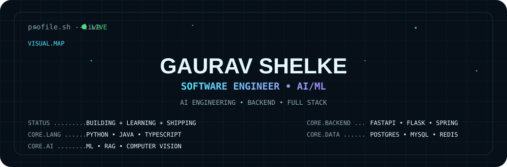

<div align="center">

<picture>
  <source media="(prefers-color-scheme: dark)" srcset="./assets/profile/dark.svg">
  <source media="(prefers-color-scheme: light)" srcset="./assets/profile/light.svg">
  
</picture>

### `profile.sh --live` · `● VERIFIED`

[GitHub](https://github.com/Gaurav-V-XXI-XIV-S) · [LinkedIn](https://linkedin.com/in/gaurav-shelke-40689b345) · [LeetCode](https://leetcode.com/u/Gaurav2125) · [Email](mailto:25shelkegp@rbunagpur.in)

</div>

## 01 // SYSTEM IDENTITY

**Gaurav Shelke** — Software Engineer · AI/ML Engineer · Backend Developer · Full-Stack Developer

I build practical software systems that combine **AI/ML, backend engineering, data, automation, and modern web technologies**.

> `STATUS` → BUILDING · LEARNING · SHIPPING  
> `FOCUS` → AI ENGINEERING · BACKEND SYSTEMS · FULL-STACK DEVELOPMENT

### Quick navigation

`[ SYSTEM ]` · `[ STACK ]` · `[ PROJECTS ]` · `[ LIVE SYSTEMS ]` · `[ DSA ]` · `[ CERTIFICATIONS ]` · `[ EDUCATION ]` · `[ CONNECT ]`

---

## 02 // ENGINEERING CORE

| Area | Engineering focus |
|---|---|
| **Education** | MCA — Artificial Intelligence & Machine Learning |
| **Background** | B.Sc. Computer Science |
| **Languages** | Python · Java · JavaScript · TypeScript · SQL |
| **Backend** | FastAPI · Flask · Spring Boot · REST APIs · Celery |
| **Frontend** | React · Next.js · Tailwind CSS |
| **AI / ML** | Machine Learning · OpenCV · NumPy · Pandas · RAG · LLM Applications |
| **Data** | PostgreSQL · MySQL · MongoDB · Redis |
| **Infrastructure** | Docker · Kubernetes · Git · GitHub · CI/CD |
| **Problem Solving** | 190+ LeetCode problems |

### Engineering domains

| AI ENGINEERING | BACKEND ENGINEERING |
|---|---|
| Machine Learning · RAG · LLM applications · AI-assisted systems | APIs · Authentication · Business logic · Async processing · Databases |

| FULL-STACK DEVELOPMENT | COMPUTER VISION |
|---|---|
| React · Next.js · REST APIs · Dashboards | OpenCV · Image similarity · Visual analysis |

| PROBLEM SOLVING | SYSTEM ENGINEERING |
|---|---|
| DSA · Algorithms · Optimization · LeetCode | Architecture · Containers · Distributed processing · Cloud concepts |

---

## 03 // TECHNOLOGY STACK

**Languages**  
`Python` `Java` `JavaScript` `TypeScript` `SQL`

**Backend**  
`FastAPI` `Flask` `Spring Boot` `REST APIs` `JWT/OAuth` `Celery`

**Frontend**  
`React` `Next.js` `Tailwind CSS` `HTML5` `CSS3`

**AI / ML**  
`Machine Learning` `OpenCV` `NumPy` `Pandas` `Matplotlib` `RAG` `LLM Applications` `Computer Vision`

**Databases**  
`PostgreSQL` `MySQL` `MongoDB` `Redis`

**Infrastructure & tools**  
`Docker` `Kubernetes` `Git` `GitHub` `CI/CD` `VS Code` `Postman` `Figma`

---

## 04 // PROJECT LAB

> Repository, deployment, documentation and screenshot links are intentionally shown only when verified. Missing evidence is marked explicitly.

### 01 — AI Code Review Platform · `● COMPLETED`

**Purpose:** An automated code-analysis platform combining GitHub integration, asynchronous processing and AI-assisted engineering workflows.

**Verified stack:** Python · FastAPI · PostgreSQL · Redis · Celery · Docker · Next.js · React · TypeScript

**Engineering evidence**
- GitHub OAuth/API integration
- Repository import
- Bug detection
- Security analysis
- Code-smell detection
- Duplicate detection
- Async processing with Redis + Celery
- Three-tier RBAC
- Automated documentation
- Unit-test generation

**Architecture:** GitHub integration → API/backend → async workers → Redis/PostgreSQL → web interface

`Repository: ADD VERIFIED URL`  
`Live demo: ADD VERIFIED URL`  
`Documentation: ADD VERIFIED URL`  
`Screenshot: ADD ASSET`

---

### 02 — Fraud Guard AI · `● COMPLETED`

**Purpose:** Machine-learning driven fraud-analysis workflow for transaction patterns, anomaly detection and risk visibility.

**Verified stack:** Python · Flask · React.js · TypeScript · SQL · Machine Learning

**Engineering evidence**
- Transaction pattern analysis
- Anomaly detection
- Feature engineering
- Model tuning
- Risk scoring
- Real-time monitoring dashboard
- Fraud trend visibility

`Repository: ADD VERIFIED URL`  
`Live demo: ADD VERIFIED URL`  
`Documentation: ADD VERIFIED URL`  
`Screenshot: ADD ASSET`

---

### 03 — Smart AI-Based Lost & Found · `● COMPLETED`

**Purpose:** A web platform for intelligent lost/found pairing using visual similarity and text matching.

**Verified stack:** Python · Flask · OpenCV · MySQL · JavaScript

**Engineering evidence**
- Image similarity
- Text matching
- Lost/found pairing
- Authentication
- REST APIs
- MySQL schema
- Admin moderation

`Repository: ADD VERIFIED URL`  
`Live demo: ADD VERIFIED URL`  
`Documentation: ADD VERIFIED URL`  
`Screenshot: ADD ASSET`

---

### 04 — Rudransh · `○ IN DEVELOPMENT / STATUS TO VERIFY`

**Positioning:** A multi-agent AI assistant architecture with memory, research, planning and security-oriented agents.

**Specified stack:** Python · FastAPI · PostgreSQL · Redis · NATS · Docker · Kubernetes · Keycloak

**Specified concepts**
- Planner agent
- Memory agent
- Research agent
- Security agent
- RAG-based memory
- Keycloak
- RBAC / ABAC
- Cloud-native architecture

`Repository: ADD VERIFIED URL`  
`Live demo: ADD VERIFIED URL`  
`Documentation: ADD VERIFIED URL`  
`Screenshot: ADD ASSET`

---

### 05 — MedSentinel AI · `△ ADD VERIFIED DATA`

**Positioning:** Healthcare cybersecurity + AI + RAG + IoMT.

**Potential stack in the specification:** Next.js · React · FastAPI · Python · MongoDB · RAG · AI/ML

Only implementation details supported by project evidence should be promoted to verified claims.

`Status: ADD VERIFIED STATUS`  
`Repository: ADD VERIFIED URL`  
`Live demo: ADD VERIFIED URL`  
`Documentation: ADD VERIFIED URL`  
`Screenshot: ADD ASSET`

> Compliance frameworks such as HIPAA, NIST, ISO 27001, GDPR, SOC 2 or DPDP are **not claimed as achieved** by this profile.

---

### 06 — Nagraksha AI · `△ ADD VERIFIED DATA`

**Positioning:** AI-powered public-safety / emergency-response engineering platform.

The specification identifies possible modules including citizen, police, control-room and admin interfaces, camera-grid analysis, crime-risk analysis, crowd counting, face recognition, number-plate recognition, violence detection and loitering detection. **Only modules verified from the actual repository should be listed as implemented.**

`Status: ADD VERIFIED STATUS`  
`Repository: ADD VERIFIED URL`  
`Live demo: ADD VERIFIED URL`  
`Documentation: ADD VERIFIED URL`  
`Screenshot: ADD ASSET`

---

## 05 // LIVE SYSTEMS

No deployment URL was supplied in the verified source set.

| Project | Live demo | Repository | Provider | Status |
|---|---|---|---|---|
| Verified deployment | ADD VERIFIED LIVE URL | ADD VERIFIED REPOSITORY URL | ADD VERIFIED PROVIDER | ADD VERIFIED STATUS |

**Rule:** A repository is not a live deployment. A local/private deployment is not labelled `LIVE`.

---

## 06 // ENGINEERING MATRIX

| Project | AI/ML | Backend | Frontend | Database | Computer Vision | Distributed |
|---|:---:|:---:|:---:|:---:|:---:|:---:|
| AI Code Review Platform | ✓ | ✓ | ✓ | ✓ | — | ✓ |
| Fraud Guard AI | ✓ | ✓ | ✓ | ✓ | — | — |
| Smart Lost & Found | ✓ | ✓ | ✓ | ✓ | ✓ | — |
| Rudransh | ✓ | ✓ | — | ✓ | — | ✓ |
| MedSentinel AI | ✓ | ✓ | ✓ | ✓ | — | — |
| Nagraksha AI | ✓ | ✓ | ✓ | — | ✓ | — |

> Matrix entries for MedSentinel AI and Nagraksha AI are kept at the architecture/positioning level from the specification; implementation claims require repository verification.

---

## 07 // PROBLEM SOLVING

### 190+ LeetCode problems solved

[Open LeetCode profile →](https://leetcode.com/u/Gaurav2125)

Focus areas:

`Arrays` · `Strings` · `Hashing` · `Binary Search` · `Linked Lists` · `Trees` · `Graphs` · `Dynamic Programming` · `Greedy` · `Sliding Window` · `Stack / Queue`

No contest rating, ranking, percentile or streak is claimed without verification.

---

## 08 // GITHUB TELEMETRY

The repository includes automation for contribution visualization. Dynamic stats are generated only through GitHub Actions after the workflows are enabled.

<picture>
  <source media="(prefers-color-scheme: dark)" srcset="./generated/stats-dark.svg">
  <source media="(prefers-color-scheme: light)" srcset="./generated/stats-light.svg">
  
</picture>

<picture>
  <source media="(prefers-color-scheme: dark)" srcset="./generated/langs-dark.svg">
  <source media="(prefers-color-scheme: light)" srcset="./generated/langs-light.svg">
  
</picture>

### Contribution snake

<picture>
  <source media="(prefers-color-scheme: dark)" srcset="./generated/github-snake-dark.svg">
  <source media="(prefers-color-scheme: light)" srcset="./generated/github-snake-light.svg">
  
</picture>

> Generated telemetry is intentionally not committed as fake data. The workflows create these assets from the repository owner after GitHub Actions runs.

---

## 09 // PLATFORM CONTRIBUTIONS

Only verified platform activity is presented as fact.

| Platform | Contribution / evidence | Profile |
|---|---|---|
| GitHub | Software projects / profile | [Open profile](https://github.com/Gaurav-V-XXI-XIV-S) |
| LeetCode | 190+ DSA problems | [Open profile](https://leetcode.com/u/Gaurav2125) |
| Coursera | Verified credentials in this repository | ADD VERIFIED PROFILE |
| Google Cloud Skills Boost | ADD VERIFIED CONTRIBUTION | ADD VERIFIED PROFILE |
| Kaggle | ADD VERIFIED CONTRIBUTION | ADD VERIFIED PROFILE |
| HackerRank | ADD VERIFIED CONTRIBUTION | ADD VERIFIED PROFILE |
| Hugging Face | ADD VERIFIED CONTRIBUTION | ADD VERIFIED PROFILE |
| Devpost | ADD VERIFIED CONTRIBUTION | ADD VERIFIED PROFILE |

---

## 10 // OPEN SOURCE

No public open-source PR/issue/commit evidence was supplied with this build.

> Public open-source contribution links will be added after verification.

---

## 11 // CERTIFICATION VAULT

### `● VERIFIED CREDENTIALS`

#### Google Cybersecurity Professional Certificate
**Google × Coursera** · **June 23, 2026** · `HRDOY9FX7AT8`

[Verify credential](https://coursera.org/verify/professional-cert/HRDOY9FX7AT8)

Certificate scope covers nine courses: Foundations of Cybersecurity; Play It Safe: Manage Security Risks; Connect and Protect: Networks and Network Security; Tools of the Trade: Linux and SQL; Assets, Threats, and Vulnerabilities; Sound the Alarm: Detection and Response; Automate Cybersecurity Tasks with Python; Put It to Work: Prepare for Cybersecurity Jobs; Accelerate Your Job Search with AI.

Certificate-stated competencies include beginner-level Python, Linux, SQL, SIEM tools, IDS, identifying common cybersecurity risks/threats/vulnerabilities and mitigation techniques.

**Certificate image:** `ADD CERTIFICATE IMAGE`

#### IBM — Introduction to DevOps
**IBM × Coursera** · **June 1, 2026** · `TGBMBLHW137B`

[Verify credential](https://coursera.org/verify/TGBMBLHW137B)

**Certificate image:** `ADD CERTIFICATE IMAGE`

#### IBM — Introduction to Cloud Computing
**IBM × Coursera** · **June 15, 2026** · `WDKW5075TXDP`

[Verify credential](https://coursera.org/verify/WDKW5075TXDP)

**Certificate image:** `ADD CERTIFICATE IMAGE`

#### IBM — Introduction to Software Engineering
**IBM × Coursera** · **July 14, 2026** · `ZVZ7A7H8N2MC`

[Verify credential](https://coursera.org/verify/ZVZ7A7H8N2MC)

**Certificate image:** `ADD CERTIFICATE IMAGE`

> The four credentials above are marked verified because the corresponding certificate PDFs were supplied. No numerical scores are assigned to these four credentials because the supplied PDFs do not state scores.

### Other credentials

The master specification also references **Google Crash Course on Python** and **MCCE Java Programming Certification**. Their credential-source files/URLs were not supplied in this build, so they are tracked as `ADD VERIFIED DATA` rather than presented as newly verified credentials.

---

## 12 // ACHIEVEMENT VAULT

| Achievement | Organization | Type | Evidence |
|---|---|---|---|
| Capgemini Technical Competition | Capgemini | **Finalist** | ADD CERTIFICATE / ADD VERIFIED URL |
| Smart India Hackathon | Smart India Hackathon | **Participant** | ADD CERTIFICATE / ADD VERIFIED URL |
| IBM Hackathon | IBM | **Participant** | ADD CERTIFICATE / ADD VERIFIED URL |
| Orange Promptathon | Orange | **Participant** | ADD CERTIFICATE / ADD VERIFIED URL |

> `Finalist ≠ Winner` · `Participant ≠ Winner`

---

## 13 // EDUCATION

### 2025 — 2027
**MCA — Computer Applications (Artificial Intelligence & Machine Learning)**  
Shri Ramdeobaba College of Engineering and Management / Shri Ramdeobaba University, Nagpur

Current academic record in the master specification: **CGPA 7.92 / 10**. The supplied provisional grade card records Semester I SGPA 7.29 and Semester II SGPA 8.55, with a printed cumulative CGPA of 7.9; the profile keeps the master specification's 7.92 value rather than silently reconciling the discrepancy.  

### 2022 — 2025
**B.Sc. Computer Science**  
**CGPA: 7.60 / 10**

---

## 14 // CURRENT FOCUS

`BUILDING`
- AI engineering and practical ML applications
- Backend architecture and API systems
- RAG / LLM applications
- Distributed processing
- Cloud-native engineering
- Cybersecurity
- Computer vision
- DSA and problem solving
- Production-quality web applications

---

## 15 // ENGINEERING ROADMAP

```text
Computer Science
      ↓
Programming
      ↓
Java + Python + SQL
      ↓
Backend Engineering
      ↓
REST APIs + Databases
      ↓
Full-Stack Development
      ↓
AI / ML
      ↓
RAG + LLM Applications
      ↓
System Design
      ↓
Scalable AI Systems
```

The roadmap represents areas of continued development, not guaranteed career outcomes.

---

## 16 // ENGINEERING PRINCIPLES

```text
01  Build before claiming
02  Prefer measurable evidence
03  Design systems, not isolated features
04  Automate repetitive work
05  Keep interfaces simple
06  Treat security as architecture
07  Document what you build
08  Ship, observe, improve
```

---

## 17 // CONNECT

**Gaurav Shelke**

[GitHub](https://github.com/Gaurav-V-XXI-XIV-S) · [LinkedIn](https://linkedin.com/in/gaurav-shelke-40689b345) · [LeetCode](https://leetcode.com/u/Gaurav2125) · [Email](mailto:25shelkegp@rbunagpur.in)

> `BUILD → SOLVE → LEARN → SHIP → ITERATE`

`Last updated: 2026-09-22`

---

<sub>AI Engineering Command Center · Evidence-first developer profile · Maintainable GitHub-native system</sub>
